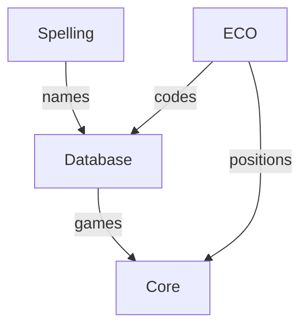

# Architecture and Diagrams

These architecture notes and diagrams show libscid from domain-centred angles.
They are companions to the API reference: use them to understand ownership,
conversion points and the shape of the public model before drilling into
individual classes and functions.

---

- [Core](architecture/core.md): The chess model encompassing games, positions, movetext, notation and PGN.
- [Database](architecture/database.md): Stores and queries game collections while materialising Core games on demand.
- [ECO](architecture/eco.md): Classifies opening positions and provides the compact opening-code vocabulary.
- [Spelling](architecture/spelling.md): The name-authority layer for canonical database names and player metadata.

