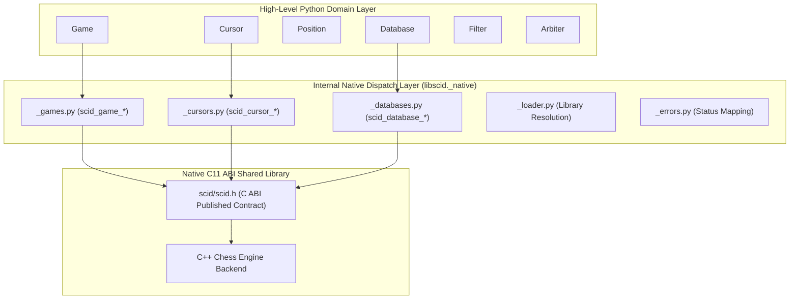

# C ABI Bridge Architecture

This document describes the architectural design of the foreign function interface (FFI) connecting the high-level Python layer of `libscid` to its native C11 ABI engine.

---

## 1. The Two-Tier Architecture

The `libscid` Python bindings employ a strict two-tier design separating native interop from public domain interfaces:



- Public Domain Layer: Contains purely idiomatic Python classes ([`Game`][libscid.Game], [`Cursor`][libscid.Cursor], [`Position`][libscid.Position], [`Database`][libscid.Database], [`Filter`][libscid.Filter]). These classes manage invariants, enforce immutability where appropriate, support Python protocols, and expose property-based access.
- Native Dispatch Layer: Encapsulated entirely within `libscid._native`. Low-level `ctypes` handles, function pointer signatures, struct layouts, and C return code translations reside exclusively here. No client application interacts directly with raw pointers.

---

## 2. Dynamic Library Discovery and Loading

Native library loading is orchestrated by `_native/_loader.py`. The loader employs deterministic lookup heuristics:

- Explicit Override: If the environment variable `LIBSCID_LIBRARY` is set, the loader checks that specific path directly, raising `FileNotFoundError` if absent.
- Standard Search Tree: The loader probes candidate paths in sequence:
  1. The bundled native directory within the installed wheel (`libscid/_native/`).
  2. The package root directory.
  3. Repository build directories (`capi/_build/`, `build/libscid/`).
  4. The current working directory.
- Platform Library Naming:
  - macOS: `libscid.dylib`
  - Linux / Unix: `libscid.so`
  - Windows: `scid.dll` or `libscid.dll`
- Windows Security Isolation: On Windows systems, `os.add_dll_directory` is invoked to register the native directory safely without polluting the global `PATH`.

---

## 3. ABI Boundary Encapsulation and Opaque Pointers

The native C11 ABI (defined in `scid/scid.h`) publishes an opaque handle contract. All primary aggregates are passed across the boundary as incomplete pointer types:

```c
typedef struct scid_game scid_game_t;
typedef struct scid_cursor scid_cursor_t;
typedef struct scid_database scid_database_t;
typedef struct scid_filter scid_filter_t;
```

This encapsulation ensures:

- Zero Binary Coupling: Internal C++ engine layouts (e.g. `Game`, `MoveTree`, `ScidBase`) can change, receive bug fixes, or undergo compiler optimisations without breaking the ABI or requiring wheel recompilation.
- Memory Layout Immunity: Python code never attempts to read struct offsets directly; all queries and state transformations are dispatched via declared C functions.

---

## 4. Status Code Mapping and Exception Propagation

Every ABI function returns a 32-bit integer status code (`scid_status_t`). Status translation is handled centrally by `_native/_errors.py`:

```python
# Status code enumeration:
SCID_STATUS_OK = 0
SCID_STATUS_ERROR_INVALID_ARGUMENT = -1
SCID_STATUS_ERROR_OUT_OF_MEMORY = -2
SCID_STATUS_ERROR_NOT_FOUND = -3
SCID_STATUS_ERROR_IO = -4
SCID_STATUS_ERROR_CORRUPT_DATA = -5
SCID_STATUS_ERROR_ILLEGAL_MOVE = -6
SCID_STATUS_ERROR_UNSUPPORTED = -7
```

Whenever a C function returns a non-zero code, the dispatch layer intercepts the return value, calls `scid_get_last_error_message()`, and raises a Python [`LibScidError`][libscid.LibScidError] containing both the numeric code and the native error string.

---

## 5. String Encoding and Zero-Copy Views

All text strings crossing the ABI boundary (PGN text, FEN strings, player names, tournament venues) are encoded as null-terminated UTF-8 byte sequences:

- Python to C: Strings are encoded to UTF-8 byte arrays via `.encode("utf-8")`.
- C to Python: Returned C string pointers are read into Python strings via `ctypes.c_char_p.value.decode("utf-8")`. Memory allocated by C for string outputs is freed deterministically using native release routines.

---

## 6. Thread Safety and Concurrency

The underlying C++ engine is re-entrant: independent `Game` and `Database` instances can be processed concurrently across separate Python threads.

Because Python bindings invoke native C code via `ctypes`, operations release the Python Global Interpreter Lock (GIL) during computationally intensive C calls, allowing genuine multi-core scaling when processing large PGN archives or evaluating board positions.
