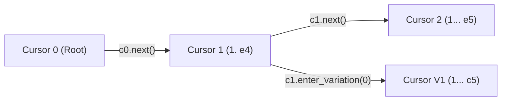

# Immutable Cursor Mental Model

This document explains the architectural rationale behind immutable cursor navigation in `libscid`, contrasting it with mutable iterator patterns and exploring its implications for tree mutation, thread safety, and referential transparency.

---

## 1. The Problem with Mutable Cursors

In traditional chess libraries and C/C++ desktop software, navigation cursors are typically stateful, mutable pointers. Calling `cursor.next()` mutates internal coordinate integers or pointer offsets in place.

While this pattern requires minimal allocation overhead, it introduces severe architectural pitfalls in modern application design:

- Spooky Action at a Distance: If a cursor instance is passed into a helper function (e.g. to evaluate candidate moves or format a PGN branch), any navigation by the callee mutates the caller's position unless defensive copying is rigorously observed.
- Concurrency and Re-entrancy Hazards: Sharing a mutable cursor across asynchronous tasks or threads requires complex mutual exclusion locks.
- Fragile Branching Logic: When traversing tree structures with multiple variations, backtracking requires tracking undo stacks to restore previous coordinates manually.

---

## 2. Immutable Value Semantics for Navigation

`libscid` resolves these issues by adopting functional value semantics for all navigational operations:



Calling navigation methods never modifies the calling instance:

```python
# c0 remains permanently anchored at the game root:
c0 = game.create_cursor()
assert c0.is_line_start

# c1 is a distinct, newly allocated cursor pointing to 1. e4:
c1 = c0.next()

# c0 is unaffected:
assert c0.is_line_start
assert c1.previous_move_san == "e4"
```

### 2.1. Referential Transparency and Backtracking

Because cursors represent immutable snapshots of coordinates along the game tree:

- Checkpoints: You can store cursors in dictionaries, lists, or undo stacks without cloning them.
- Effortless Backtracking: Exploring a variation does not disturb earlier line pointers. When finished with a branch, simply discard the branch cursor and resume from the original instance.
- Functional Pipelines: Cursors can be passed cleanly to pure mapping, filtering, or scoring functions without fear of side-effects.

---

## 3. The Dual Nature: Immutable Navigation vs Mutable Tree State

A common question from engineers is how immutability reconciles with game editing (such as appending moves, modifying commentary, or inserting sub-lines).

In `libscid`, the division of responsibility is precise:

```
┌────────────────────────────────────────────────────────┐
│                   Game Aggregate                       │
│  (Stateful, Mutable C++ Move Tree and Header Registry) │
└───────────────────────────▲────────────────────────────┘
                            │ Mutates via C ABI
                ┌───────────┴───────────┐
                │        Cursor         │
                │  (Immutable Pointer)  │
                └───────────────────────┘
```

- Cursors are Immutable Pointers: A cursor is simply a lightweight handle pointing to a specific coordinate within the move tree. Its position and history cannot be mutated.
- The Game Aggregate is Mutable: When a mutating method is called on a cursor (such as [`append_move()`][libscid.Cursor.append_move], [`add_variation()`][libscid.Cursor.add_variation], or [`set_comment()`][libscid.Cursor.set_comment]), the mutation is applied directly to the underlying `Game` tree. The mutation method then returns a new `Cursor` instance pointing to the newly created node.

```python
game = libscid.Game()
c0 = game.create_cursor()

# append_move mutates the underlying tree and returns a new pointer:
c1 = c0.append_move("e4")
c2 = c1.append_move("e5")

# The tree now has two moves:
assert game.mainline_move_count == 2
```

---

## 4. Performance and Handle Overhead

Because cursors wrap lightweight C pointers (`scid_cursor_t*`), allocating a new cursor in Python is exceptionally cheap:

- Minimal Memory Footprint: Each cursor instance wraps a single 64-bit C pointer handle and a Python reference to its parent `Game`.
- Deterministic Native Reclaim: As temporary cursor objects go out of scope, their native handles are returned to the C allocator via `weakref.finalize`, avoiding memory leaks or garbage accumulation.

---

## 5. Summary

The immutable cursor pattern provides:

- Predictability: No unexpected positional state mutations across function boundaries.
- Ergonomics: Natural expression of tree traversal and variation exploration.
- Safety: Complete separation between navigational coordinates and game tree modifications.
