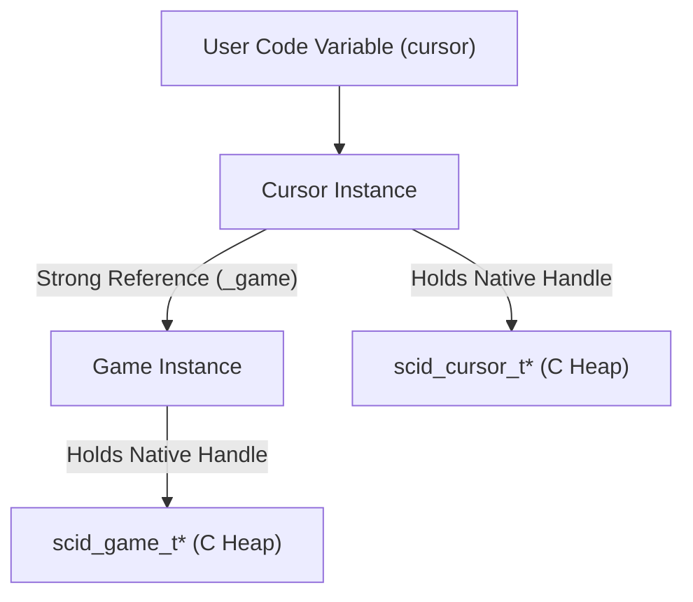

# Memory Model and Handle Lifecycles

This document details how `libscid` bridges the memory lifecycles of native C++ engine heap allocations and the Python CPython runtime, ensuring complete memory safety, zero use-after-free conditions, and predictable resource finalisation.

---

## 1. Dual-Runtime Memory Architecture

The `libscid` Python package operates across two distinct memory runtimes:

```
┌────────────────────────────────────────────────────────┐
│                   CPython Runtime                      │
│  - Reference counting + cyclic garbage collector      │
│  - Python object wrappers: Game, Cursor, Database      │
│  - weakref.finalize registration                       │
└───────────────────────────▲────────────────────────────┘
                            │ Foreign Function Interface (ctypes)
┌───────────────────────────▼────────────────────────────┐
│                  Native C++ Engine                     │
│  - Standard heap allocation (malloc/new)               │
│  - Opaque pointer handles: scid_game_t*, scid_cursor_t │
│  - Explicit C deallocation routines (scid_free_*)      │
└────────────────────────────────────────────────────────┘
```

The fundamental invariant is: Every C aggregate allocated across the ABI boundary must be reclaimed exactly once, and no native function may ever dereference a previously deallocated C pointer.

---

## 2. Deterministic Finalisation with `weakref.finalize`

A common anti-pattern in Python C extensions is placing deallocation logic inside `__del__`. In Python, `__del__` exhibits severe hazards:

- Delayed Execution: In the presence of reference cycles, `__del__` may be delayed indefinitely or skipped during interpreter shutdown.
- Resurrection Bugs: Accessing `self` inside `__del__` can inadvertently re-bind references, resurrecting doomed instances in corrupted states.
- Threading and Re-entrancy: Unhandled exceptions inside `__del__` are printed to `sys.stderr` and ignored, masking critical deallocation failures.

`libscid` replaces `__del__` across all wrapped native entities with `weakref.finalize`:

```python
# In Cursor._from_handle:
cursor._finalizer = weakref.finalize(cursor, native.free_cursor, handle)

# In Game.__init__:
self._finalizer = weakref.finalize(self, self._native.free_game, self._handle)
```

Advantages of `weakref.finalize`:

- Isolated Callbacks: The callback executes without binding `self`, eliminating the possibility of object resurrection.
- Guaranteed Invocation: Finalisers are guaranteed to execute either when the Python object is collected or during interpreter shutdown.
- Unlinking Support: If an object is explicitly closed or disposed of early, `finalizer.detach()` cleanly prevents double-freeing.

---

## 3. Parent Reference Retention and Lifetime Invariants

In chess game trees, cursors and filters depend entirely on the memory allocated by their parent aggregates:

- A `scid_cursor_t*` points directly into nodes of a `scid_game_t*` tree.
- A `scid_filter_t*` indexes games belonging to a `scid_database_t*`.

If a user drops their reference to a `Game`, but retains a `Cursor`, collecting the `Game` would free the C++ move tree, leaving the cursor holding a dangling pointer.

To prevent this use-after-free hazard, `libscid` enforces parent reference retention:

```python
class Cursor:
    def _from_handle(cls, native, game, handle):
        cursor = cls.__new__(cls)
        cursor._native = native
        cursor._game = game  # Strong reference keeps parent Game alive!
        cursor._handle = handle
        cursor._finalizer = weakref.finalize(cursor, native.free_cursor, handle)
        return cursor
```

As long as any `Cursor` remains reachable anywhere in Python memory, its parent `Game` cannot be collected by the Python runtime, guaranteeing that the underlying C++ move tree remains valid.



Even if `del game` is executed, the `Game` instance and its `scid_game_t*` handle survive because `cursor._game` maintains an active reference.

---

## 4. Database Resources and File Locking

While memory allocations can wait for garbage collection, operating system resources such as file descriptors require explicit deterministic management.

When a [`Database`][libscid.Database] is opened via [`Database.open_pgn_read_only`][libscid.Database.open_pgn_read_only], the native engine acquires read locks and file handles to the underlying PGN file:

- Explicit Closure: Calling [`database.close()`][libscid.Database.close] closes OS file handles and disposes of in-memory index structures immediately.
- Defensive Finaliser: If client code neglects to call `close()`, the `weakref.finalize` callback acts as a fallback to ensure files are closed and memory is returned to the OS.

---

## 5. Summary of Guarantees

- No Double Frees: `weakref.finalize` unlinks callbacks upon explicit closure.
- No Dangling Pointers: Subordinate entities maintain strong references to their root aggregates.
- Zero Memory Leaks: Every native handle allocation is paired with an ABI release call.
